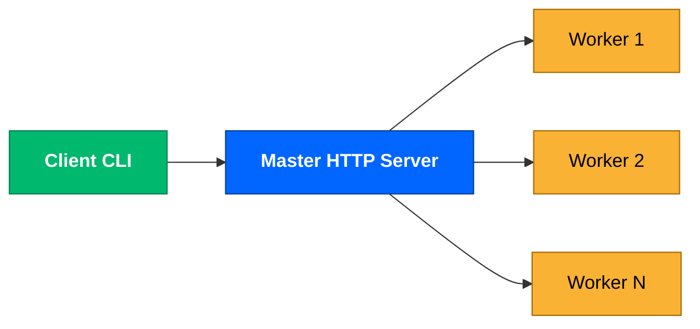
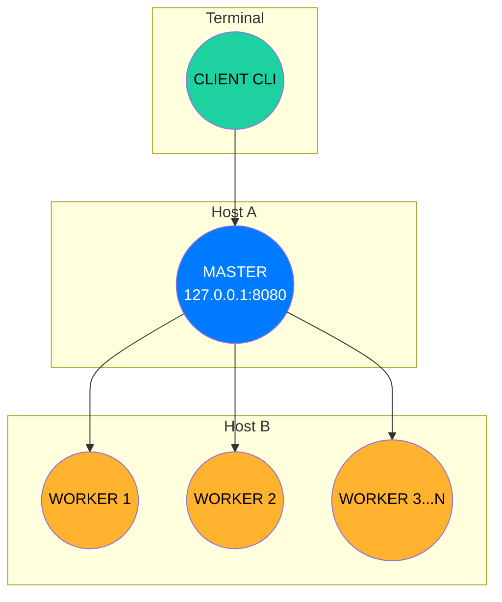
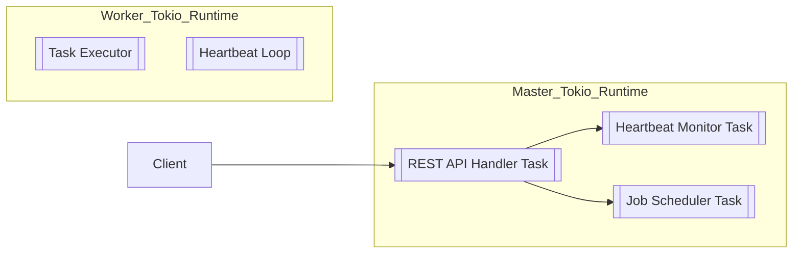
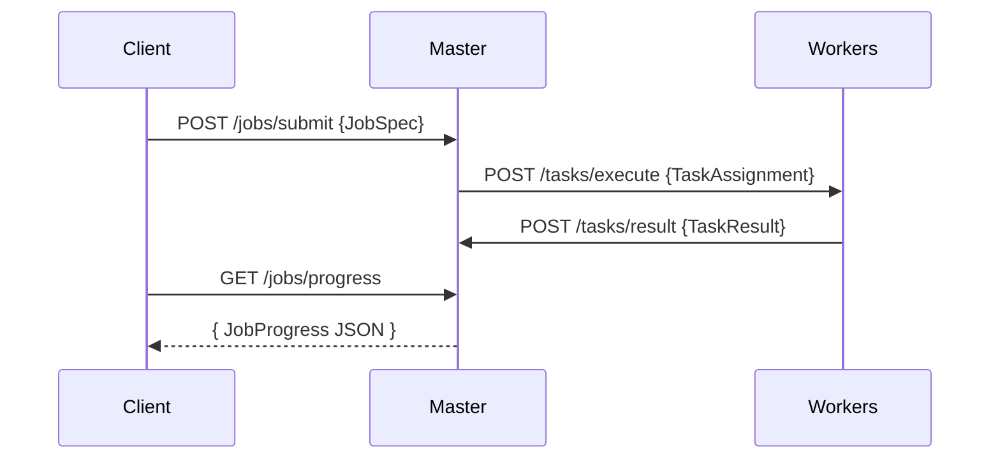
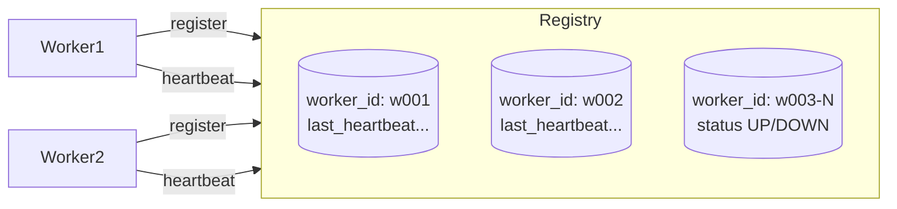
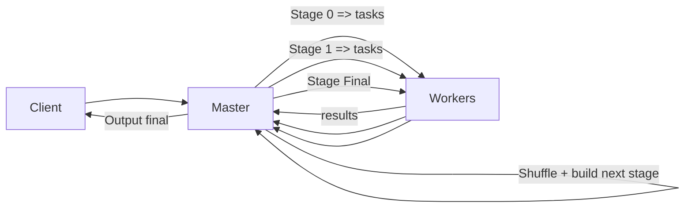
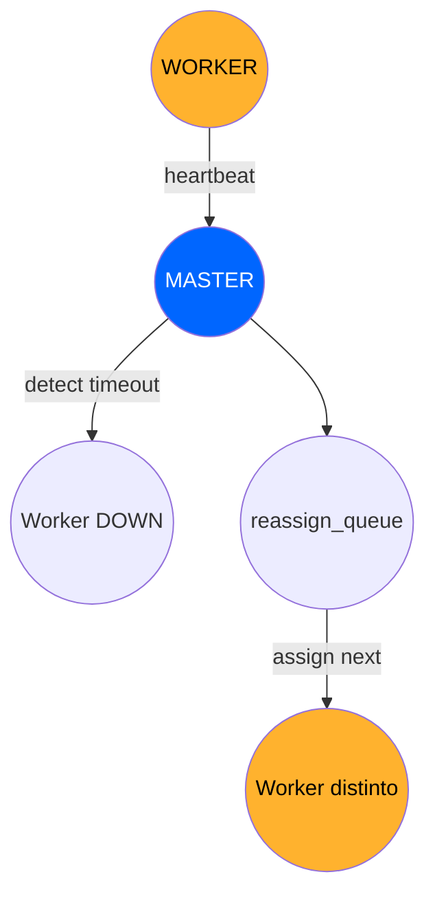

# Arquitectura del Sistema Distribuido Proyecto Ruta A — Batch DAG (mini-Spark)

## Descripción General

El sistema implementa un motor distribuido de procesamiento batch inspirado en Spark, basado en un modelo master/worker y un cliente ligero de línea de comandos. La idea central es que el master mantiene todo el estado global (workers registrados, jobs, tareas y métricas), mientras que los workers son procesos relativamente simples que ejecutan operaciones puras sobre datos (map, filter, reduce_by_key, join) y reportan resultados. El client actúa como interfaz de usuario: envía trabajos al master, consulta el progreso y lista los workers disponibles.

Cada componente es independiente:

- **master**: servidor central HTTP que coordina y planifica el trabajo.

- **worker**: ejecutor que se registra ante el master, recibe tareas y las procesa.

- **client**: CLI que habla solo con el master usando HTTP/JSON.

El objetivo arquitectónico es separar el master del tabajo que para eso sirven los workers, usando HTTP asíncrono y estructuras de datos en memoria para permitir iterar rápido.

Este diagrama representa la arquitectura global del sistema. Resume el rol de los tres procesos fundamentales —master, workers y client— y cómo interactúan mediante HTTP/JSON.
Su objetivo es brindar una vista macro para entender quién coordina, quién ejecuta y quién usa el sistema.

## Procesos

En tiempo de ejecución normalmente hay:

- Un proceso master escuchando en 127.0.0.1:8080.

- Uno o más procesos worker, cada uno en un puerto configurable (WORKER_PORT).

- Uno o varios procesos client invocados desde la terminal para enviar jobs y consultar estado.

Toda comunicación se hace por HTTP/JSON.

Este diagrama refleja los procesos que existen simultáneamente en ejecución.
Representa la distribución real del sistema en runtime:

## Hilos y Tareas Asíncronas

Dentro de cada proceso se usa el runtime asíncrono **Tokio**. Esto significa que el código no crea manualmente threads para cada conexión, sino que lanza tasks ligeras que el runtime multiplexa sobre un pool de threads.

En **master**, el servidor HTTP de **Axum** (framework de http) levanta una task por conexión entrante (por ejemplo, registros de workers, heartbeats o envío de resultados de tareas). Además, se lanza una task de fondo llamada monitor_workers, que se ejecuta periódicamente y revisa el estado de los workers y de las tareas pendientes. Esta task es esencial para la tolerancia a fallos, pues detecta workers caídos y dispara la replanificación de tareas.

En el **worker**, se levanta un pequeño servidor HTTP que expone /api/v1/tasks/execute, y en paralelo se lanza una task en segundo plano que envía heartbeats periódicos al master. Cada solicitud de ejecución de tarea se maneja como una task independiente, de forma que un worker puede procesar varias tareas en paralelo (limitado por el número de threads y el tipo de trabajo).

El **client** también usa **Tokio**, pero su uso es mucho más simple: hace solicitudes HTTP puntuales (list-workers, submit-job, get-progress) y termina.

Aquí se representa cómo el sistema NO usa threads tradicionales para cada conexión, sino tasks asíncronas multiplexadas por Tokio.

## Protocolo e Intercambio de Mensajes

Toda la comunicación entre componentes se realiza mediante:

- Transporte: TCP/IP

- Protocolo de aplicación: HTTP/1.1

- Formato de mensajes: JSON (serializado/deserializado con serde)

- Framework: Axum en el lado servidor (master y worker), reqwest en el lado cliente.

Los mensajes incluyen un campo de versión (MESSAGE_VERSION) para permitir la evolución del protocolo sin romper compatibilidad. Por ejemplo, el registro de un worker (RegisterRequest / RegisterResponse) y los heartbeats (HeartbeatRequest / HeartbeatResponse) llevan esta versión de mensaje.

Este diagrama muestra el intercambio real de mensajes. Ilustra quién llama a quién, en qué dirección viajan solicitudes y qué tipo de payload contienen.

## API expuesta por el Master

El master expone una serie de endpoints REST:

- POST /api/v1/workers/register
Endpoint al que se conectan los workers al iniciar. El worker envía su host, port y opcionalmente su versión de mensaje. El master le asigna un worker_id único (p.ej. w001) y lo registra en su tabla de workers, marcándolo como Up.

- POST /api/v1/workers/:id/heartbeat
Endpoint que recibe heartbeats periódicos de cada worker. Al llegar un heartbeat, el master actualiza el last_heartbeat del worker y, si estaba marcado como Down, lo pasa nuevamente a Up.

- GET /api/v1/workers
Devuelve una lista de workers registrados con su estado actual (Up/Down) y el tiempo del último heartbeat. Este endpoint es consumido por el client list-workers.

- POST /api/v1/jobs/submit
Recibe un JobSpec desde el cliente, que describe:
   - el nombre del job,
   - la fuente de datos (DatasetSource: inline, archivo de texto, CSV o JSONL),
   - los stages que forman el DAG (por ejemplo: map_add:5, filter_gt:10, reduce_by_key, join, etc.),
   - y parámetros como chunk_size.

El master carga el dataset, lo parte en chunks o particiones y crea un JobInfo en memoria con toda la información necesaria para seguir la ejecución del job.

- GET /api/v1/jobs/:id/progress
Expone el estado de un job concreto: número de tareas totales, tareas completadas, tareas falladas y estado global (running, stage_complete, completed, failed). Este endpoint es el que usa client get-progress.

- POST /api/v1/jobs/:id/task_result
Es llamado por los workers al finalizar una tarea. Contiene el resultado parcial (output) y, opcionalmente, un mensaje de error. El master actualiza los contadores del job, acumula la salida del stage y decide si el stage ha terminado y si se puede avanzar al siguiente.

- POST /api/v1/jobs/:id/next_stage
Permite disparar manualmente la ejecución del siguiente stage de un job multi-etapa. Internamente delega en la función start_stage, que lee la salida del stage anterior, realiza el shuffle/particionamiento y envía nuevas tareas a los workers.

- GET /api/v1/metrics
Devuelve métricas globales del sistema: jobs enviados, tareas completadas, tareas falladas y número de workers Up/Down. Esta API sirve para la observabilidad básica en la última etapa del proyecto.

## API expuesta por los Workers

Cada worker tiene un único endpoint relevante:

- POST /api/v1/tasks/execute
El master envía una TaskAssignment que describe:

   - job_id y task_id,

   - operación a ejecutar (map_add, map_mul, filter_gt, filter_lt, reduce_by_key, join, flat_map, etc.),

   - datos de entrada (input, left, right),

   - parámetro opcional (param),

   - identificador de stage (stage_id) y número de reintento.

El worker ejecuta la operación localmente, produce un vector de salida (output) y luego envía un TaskResult de vuelta al master usando el endpoint de resultados descrito antes. Opcionalmente puede simular tareas largas introduciendo un retraso configurable (TASK_EXECUTION_DELAY_SECS).

## Modelo de Memoria y Estructuras de Estado

El master mantiene todo su estado en memoria dentro de la estructura AppState, que se comparte entre handlers HTTP mediante Arc<RwLock<...>>. Esto permite acceso concurrente: múltiples peticiones pueden leer al mismo tiempo, y las escrituras se hacen con exclusión mutua.

struct AppState {
    registry: Arc<RwLock<HashMap<String, WorkerInfo>>>,
    jobs: Arc<RwLock<HashMap<String, JobInfo>>>,
    metrics: Arc<RwLock<Metrics>>,
}

## Registry de Workers

La tabla registry almacena objetos WorkerInfo, que contienen:

- id: identificador lógico (w001, w002, …),

- host y port: dirección donde el master puede contactar al worker,

- last_heartbeat: SystemTime del último heartbeat recibido,

- status: WorkerStatus::Up o WorkerStatus::Down.

Los handlers de registro y heartbeats escriben aquí; el monitor de workers lo lee y actualiza el estado en función del tiempo transcurrido desde last_heartbeat.

Cada worker se registra, se mantiene actualizado con heartbeats, y puede caer (DOWN) si deja de responder.

## Estado de los Jobs

Cada trabajo enviado al master se representa con un JobInfo. Esta estructura es el corazón de la planificación y tolerancia a fallos en memoria:

   - Información básica: job_id, name, status.

   - Conteo de tareas: total_tasks, completed_tasks, failed_tasks.

   - Seguimiento de tareas en vuelo: outstanding_tasks: HashMap<task_id, worker_id>.

   - Reasignación: reassign_queue, donde se encolan tareas que deben reintentarse.

   - Payloads persistidos: task_payloads, que guardan la entrada y parámetros de cada tarea para poder reconstruirla cuando un worker cae.

   - Multi-stage DAG: una lista de stages y un índice current_stage para saber qué etapa está en ejecución.

   - Resultado intermedio: stage_output, donde se acumula la salida de cada stage (típicamente como pares (key, value) o tuplas en caso de join).

Gracias a estas estructuras, el master puede responder preguntas de progreso, detectar que un stage terminó, preparar el shuffle para el siguiente stage y reintentar tareas sin perder información.

## Métricas en Memoria

El módulo Metrics guarda contadores globales:

   - jobs_submitted

   - tasks_completed

   - tasks_failed

Estos campos se actualizan cada vez que se recibe un job nuevo o un resultado de tarea, y se exponen vía /api/v1/metrics.

## Planificación y Ejecución de Jobs

La planificación ocurre en dos niveles: dentro de un stage (cómo se parte el dataset en tareas) y entre stages (cómo se propagan los resultados a la siguiente etapa).

## Ingreso de un Job

Cuando el cliente llama a submit-job, construye un **JobSpec** que puede venir en modo “nuevo” (con source + stages) o modo legado (con operation + input). El master recibe este **JobSpec** en submit_job.

Primero se construye la lista de stages:

   - Si el job viene con stages, se usa directamente (DAG multi-etapa).

   - Si no, se crea un único stage a partir de operation y param (modo semana 1).

Luego se carga el dataset de entrada mediante DatasetSource:

   - Inline: un vector de enteros enviado directamente por el cliente.

   - File: archivo de texto plano donde se parsean números separados por comas, espacios o saltos de línea.

   - Csv: archivo CSV del que se extraen números por columnas.

   - Jsonl: archivo JSONL con un campo numérico value en cada línea.

## Particionado y Asignación de Tareas

Para operaciones normales (map, filter, reduce_by_key, flat_map), el master divide el vector de entrada en chunks de tamaño fijo (chunk_size). Cada chunk se transforma en una **TaskAssignment** y se asigna a un worker usando un esquema simple de round-robin: la tarea task-0 al primer worker, task-1 al segundo, etc.

Para la operación join, la lógica es distinta: se asume que hay dos colecciones de pares (key, value) (lado izquierdo y lado derecho). El master particiona ambos lados por clave, usando key % num_partitions para distribuir las claves en particiones. Cada partición se manda como una tarea de tipo join, donde el worker construye mapas en memoria y genera la intersección de claves [k, left_val, right_val, ...].

En ambos casos, antes de dar una tarea el master:

1. Guarda el payload de la tarea en **task_payloads** para poder reintentarla.

2. Marca la tarea como pendiente en **outstanding_tasks**.

El envío de cada tarea se hace en una task Tokio separada, con reintentos y backoff exponencial: si el worker no responde o devuelve un error HTTP, la asignación se reintenta hasta tres veces. Si finalmente falla, la tarea se retira de **outstanding_tasks** y se encola en **reassign_queue** para intentar asignarla a otro worker más adelante.

## Avance de Stages (Shuffle y DAG)

Cada vez que un worker termina una tarea, llama a /api/v1/jobs/:id/task_result. El master:

1. Saca la tarea de **outstanding_tasks**.

2. Incrementa **completed_tasks** o **failed_tasks**.

3. Añade el *output** de la tarea a stage_output (para operaciones normales o join).

Cuando completed_tasks + failed_tasks == total_tasks, el master sabe que el stage actual terminó:

- Si hay fallos (failed_tasks > 0), el job se marca como **failed**.

- Si no hay fallos y existe un siguiente stage, el job se marca como **stage_complete** y queda listo para que se dispare start_stage (vía endpoint o vía monitor).

- Si no hay más stages, el job se marca como **completed**.

La función **start_stage** toma **stage_output**, la interpreta como una secuencia de pares (key, value) y aplica un shuffle: reparte los pares en particiones basadas en la clave (key % num_workers), generando nuevas tareas para el siguiente stage. De nuevo se realiza asignación round-robin y se reinician los contadores de tareas en el **JobInfo**.

## Mecanismos de Fallos y Reintentos

La arquitectura incorpora tolerancia a fallos en varios niveles.

### Detección de Workers Caídos (Heartbeats)

Cada worker ejecuta en segundo plano una tarea que envía heartbeats al master cada **HEARTBEAT_INTERVAL_SECS** segundos. El master, por su parte, ejecuta monitor_workers periódicamente:

   1. Calcula el tiempo desde el último heartbeat (now - last_heartbeat).

   2. Si ese tiempo excede HEARTBEAT_TIMEOUT_SECS, el worker pasa de Up a Down.

   3. Cada cambio se loguea, y el worker permanece Down hasta que vuelva a enviar un heartbeat.

Este mecanismo evita asumir que un worker está disponible cuando lleva demasiado tiempo sin responder.

### Replanificación de Tareas

Cuando uno o varios workers se marcan como **Down**, el monitor recorre todos los **JobInfo**:

   - Busca tareas en outstanding_tasks asignadas a esos workers.

   - Para cada una, quita la asignación y la mueve a reassign_queue.

   - Recupera el payload original (input, operación, parámetro) desde task_payloads para poder reconstruir una TaskAssignment.

A continuación, el monitor obtiene la lista de workers que siguen **Up** y trata de reasignar tareas de **reassign_queue** a estos workers de forma round-robin, usando de nuevo reintentos y backoff para el envío. Si el envío falla repetidamente, la tarea podría quedar sin ejecutar y ser procesada en iteraciones futuras del monitor.

### Reintentos de Envío de Tareas

Tanto en el flujo normal como en la replanificación, el envío de una tarea a un worker se hace con un bucle de reintentos:

   - Se intenta hacer el POST al worker hasta un máximo de 3 veces.

   - Entre intentos se espera un tiempo que crece exponencialmente (1s, 2s, 4s, …).

   - Si después de los intentos sigue fallando, la tarea se considera no despachada y vuelve a la cola de reasignación o se marca para tratamiento posterior.

Este enfoque cubre tanto fallos temporales de red como caídas de procesos worker.

